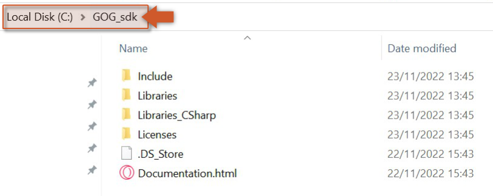
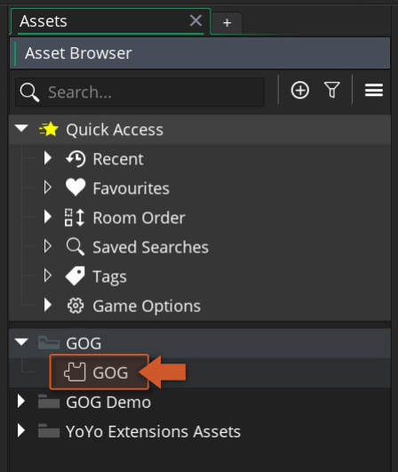
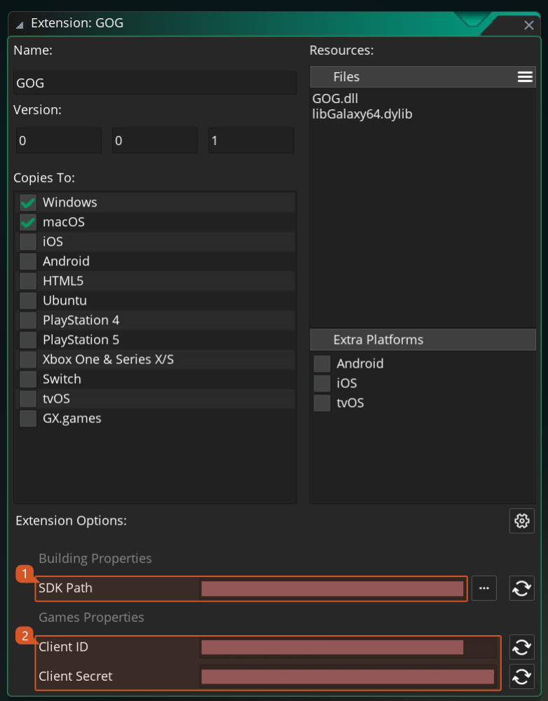

<!-- Page HTML do not touch -->
<a />
[Back To Top](#top)

# <a name="Setup_Guide">Setup Guide

To use the GOG API extension you should follow these steps:

1. Import this GOG API extension into your project, if you haven't done that already.
2. The GOG Launcher needs to be **installed** , **running** and with an account **logged in** ([official site](https://www.gog.com/galaxy)).
3. Download GOG SDK (v1.150) from GOG's [developer portal](https://devportal.gog.com/welcome) and extract the contents of the zip into a directory of your choice (e.g.: `C:\GOG_sdk`). 
      

4. To set up your game properties, double click on the GOG extension in your Asset Browser in the IDE. 
      

5. At the bottom of the extension widow you will find all the configurable options of the GOG extension. 
      

6. The options are split in two sections **Building Properties** and **Game Properties** . The first one is a folder path that should point to the extracted folder of step 3, the second section will allow you to configure all the settings that are required for running and publishing a game to GOG Store.

  

---